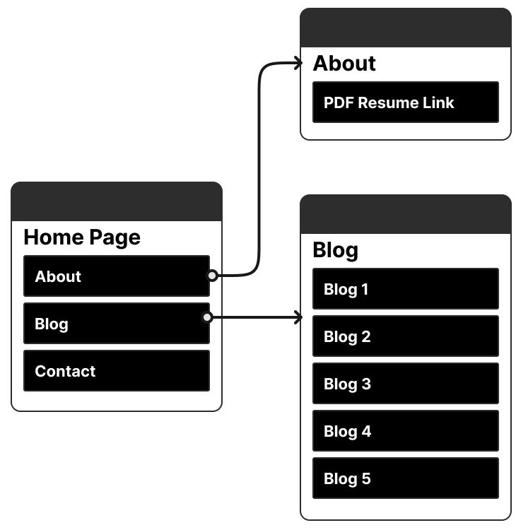
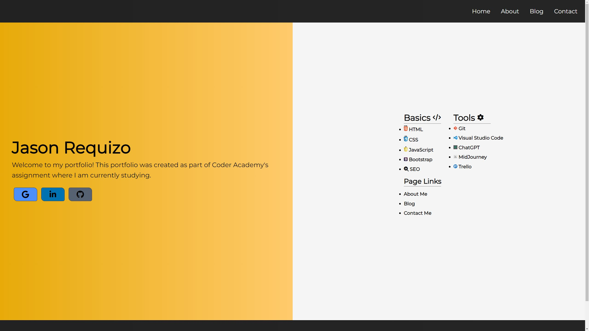
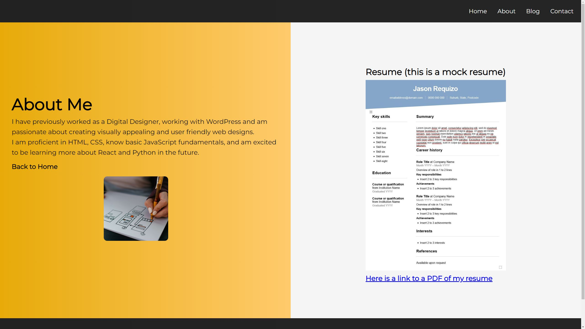
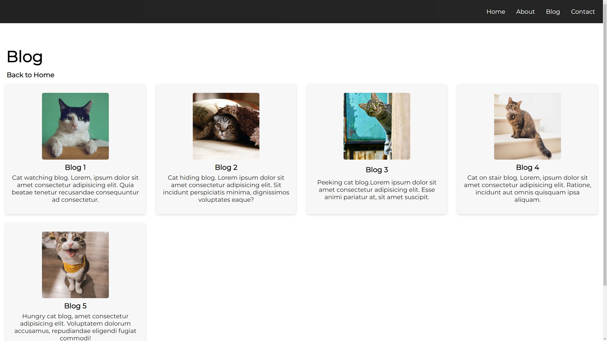
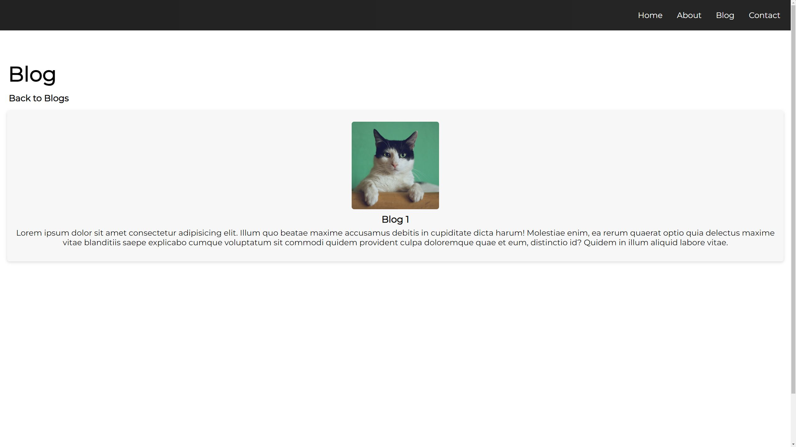
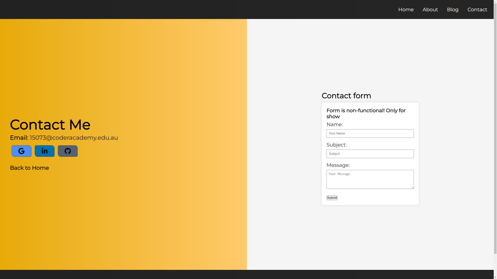

# T1A2 Assessment

## Coder Academy Online Portfolio

- Link to portfolio - [here](https://website-name.com)
- Link to Github - [https://github.com/jquizo](https://github.com/jquizo)
- Link to presentation - [here]()

## Description

- The purpose of this portfolio is to learn HTML, CSS & Website deployment
- To Showcase my skills and projects to potential employers

## Functionality/Features

- Responsive - desktop, tablets & mobile
- Navbar and footer
- PDF resume link

## Assignment requirements

### R1 HTML Documents

- Document 1 - Homepage
- Document 2 - About page
- Document 3 - Blog page
- Document 4 - Contact page

### R2 Components

- Component 1 - Navigation bar
- Component 2 - Hero section
- Component 3 - Footer
- Component 4 - Contact form

### R3 Components

- Component 1 - Skills section
- Component 2 - About section
- Component 3 - Resume section
- Component 4 - Blog section
- Component 5 - Contact section with buttons

## Sitemap

##Screenshots

#### Homepage

#### About page

#### Blog page

#### Individual blog

#### Contact page

### Target audience

- Potential employers

### Tech stack

- HTML
- CSS
- Deployment platform - Netlify
